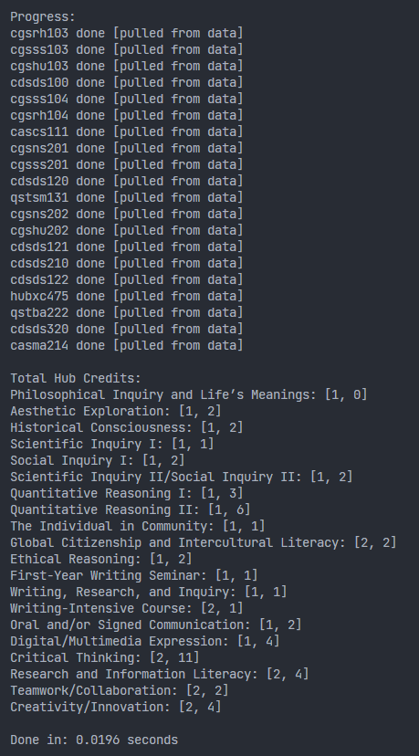
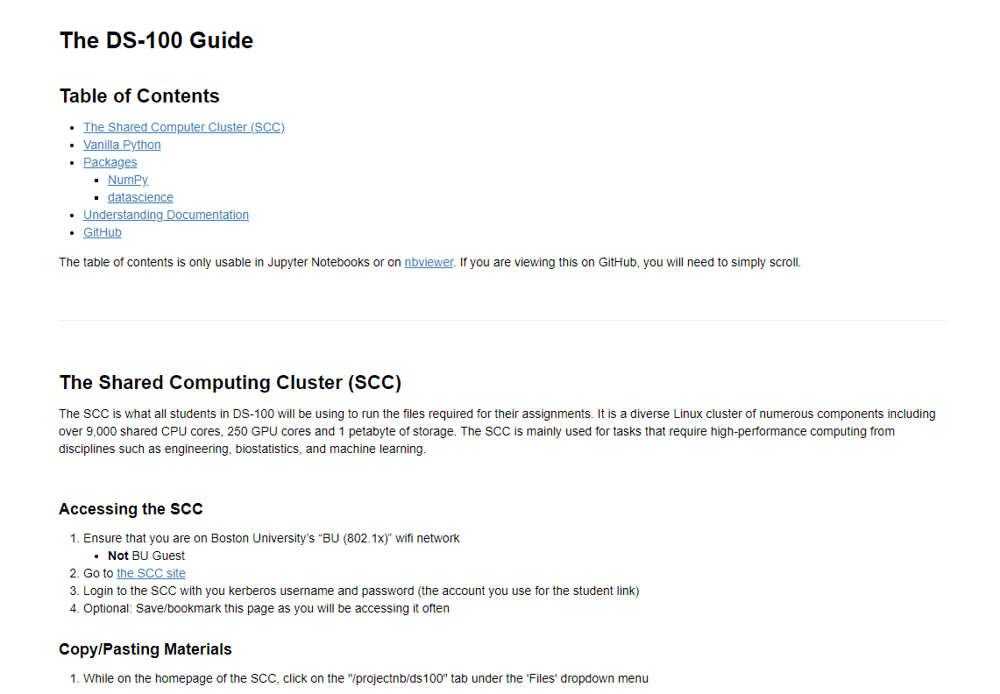

# About Me
Hi! I'm Ethan Chang, a sophomore at Boston University majoring in Data Science and minoring in Business Administration & Management. My interests are software developement, machine learning, and spending 3 hours to automate a three second task.

---
# Personal Projects

<table>
  <tr>
    <td>
## [Boston University Course Searcher](https://github.com/ethanc-ec/ScheduleHub)
* Created a tool that uses a text based interface to:
  * Check the information about a class
  * See the Hub credits and numerical credits each class gives
  * Check for the available sections/times for lectures and labs/discussions
* Used various packages to scrape information from Boston University’s  course websites
* Cleaned scraped information, then sorted and stored it in a persistent storage file
* Deployed performance changes using persistent storage that reduced process time by up to 99%
* Used GitHub to automatically run unit tests and test compatibility on Linux and Windows
    </td>
    <td>

    </td>
  </tr>

# Work Projects

## [DS 100 Technical Guide](https://github.com/langdon/ds-100/tree/cethan-ec_file_jupyter-draft)
* Created a Jupyter Notebook that serves a guide for all students in [DS-100](https://www.bu.edu/academics/cds/courses/cds-ds-100/)
* Explained various functions and their uses cases from Python packages such as [NumPy](https://numpy.org/) and [datascience](http://data8.org/zero-to-data-8/datascience.html)

